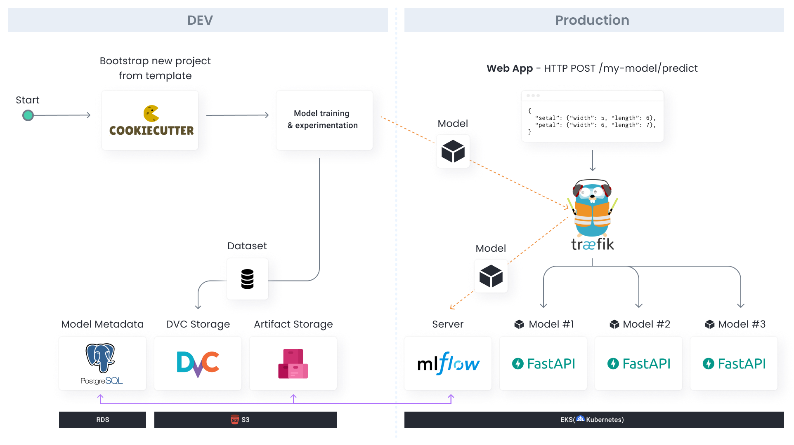

# mlplatform-workshop

This repo contains example code for a (very basic) ML platform.

 * The **model-template** directory contains an example for a Cookiecutter-based template that data scientists can clone to start a new project.
 * The **infra** directory contains Pulumi code that spins up the shared infrastructure of the ML platform, such as Kubernetes, MLFlow, etc.

### Why?

As data science teams become more mature with models reaching actual production, the need for a proper infrastructure becomes crucial. Leading companies in the field with massive engineering teams like Uber, Netflix and Airbnb had created multiple solutions for their infrastructure and named the combination of them as “ML Platform”.

We hope this repo can help you get started with building your own ML platform ❤️

### Based on the following projects:
* [FastAPI](https://fastapi.tiangolo.com/) - for model serving
* [MLFlow](https://www.mlflow.org/) - for experiment tracking
* [DVC](https://dvc.org/) - for data versioning
* [Cookiecutter](https://cookiecutter.readthedocs.io/) - for the model template
* [Pulumi](https://www.pulumi.com/) - Infrastructure as Code
* [GitHub Actions](https://github.com/features/actions) - for CI/CD
* [Traefik](https://traefik.io/) - API gateway
* [Poetry](https://python-poetry.org/) - Python dependency management

When building your own ML platform, do not take these tools for granted! [Check out alternatives](https://mlops.toys) and find the best tools that solve each one of your problems.

### What's missing from this?

Well... a lot actually. Here's a partial list:

* HTTPS & Authentication
* Environments (staging, production)
* Common library for preprocessing, postprocessing, etc
* Model input & validation
* Training orchestration
* and probably much more!

We would love your help!
